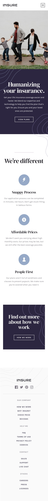
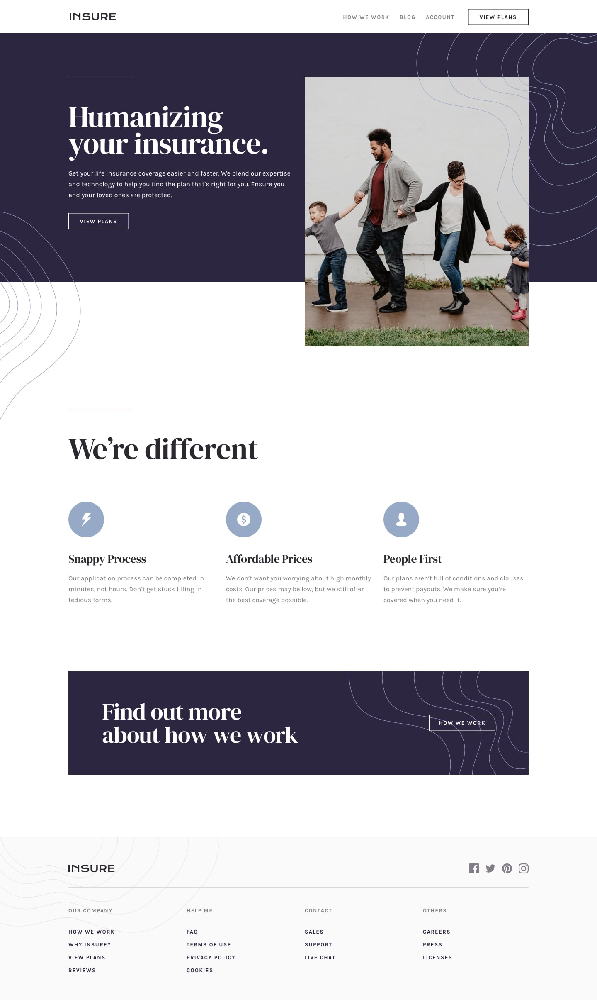

# Task 8.2 UI Challenge

A simple React UI project built with **Vite**, **TypeScript**, and **React 19**.  
The project includes a `Navbar`, `Hero`, `Main`, and `Footer` component for a modular UI structure.

---

## 🚀 Tech Stack

- **React** `^19.1.1`
- **React DOM** `^19.1.1`
- **Vite** `^7.1.2` – fast development build tool
- **TypeScript** `~5.8.3`
- **ESLint** `^9.33.0` – linting
- **@vitejs/plugin-react** `^5.0.0`

---

## ✨ Features
- Responsive Navbar
- Hero section with intro content
- Modular components (Navbar, Hero, Main, Footer)
- Styled with CSS + optional styled-components
- Icons via react-icons
---

## 📂 Project Structure

```
src/
├── components/
│ ├── Navbar.tsx
│ ├── Hero.tsx
│ ├── Main.tsx
│ └── Footer.tsx
├── App.tsx
├── App.css
└── main.tsx
```

---

## ⚡ Getting Started

### 1️⃣ Clone the repository

```bash
git clone https://github.com/SineMag/Task8.2-UI-Challenge
cd task-8.2-ui-challenge
```

### 2️⃣ Install dependencies
```bash
npm install
```

```bash
npm install react-icons
```
```bash
npm install styled-components
```


### 3️⃣ Start the development server
```bash
npm run dev
```

## 📸 Designs
- Mobile Design  
  

- Desktop Design  
  
